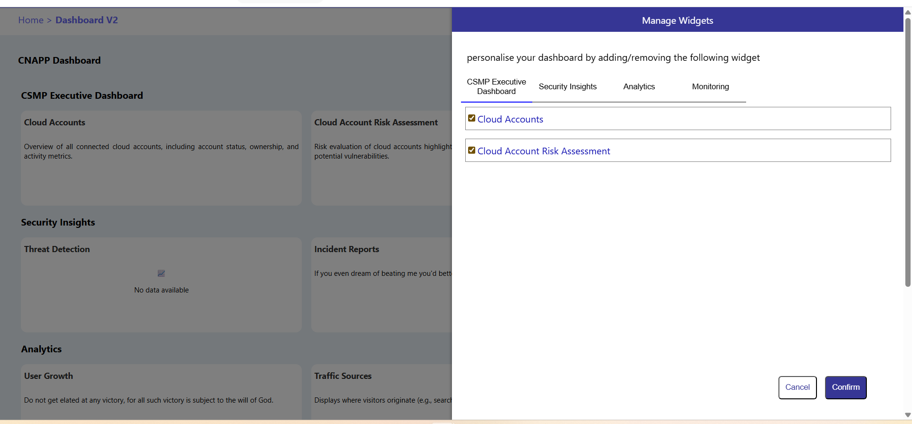

📊 Dashboard Project:

A responsive dashboard built using React that displays dynamic widgets.Each widget has a title, text and integrates with external APIs to display real-time/random data such as quotes.

🚀Github Repository: https://github.com/ChVAjayReddy/dashboardproject

🚀 Live Demo: https://chvajayreddy.github.io/dashboardproject/

✨Features:

- Responsive Layout (Grid system with media queries for mobile & desktop)

- Widgets with title and text

- Shimmer UI loading effect

- Sidebar for selecting/deselecting widgets

- Modal for adding new category and new widget

- Dynamic content – some widgets display random quotes

- Hover effects with shadow and remove button

🛠️ Tech Stack:

- Frontend: React.js

- Styling: CSS3, Flexbox, Grid, Tailwind (optional)

- Deployment: GitHub Pages

- API: DummyJSON

📸 Screenshots:

### Dashboard View

### Sidebar (Widget Management)

### Modal Box

### Mobile Responsive View

⚙️ Installation:

1.Clone the repo:

git clone https://github.com/chvajayreddy/dashboardproject.git

cd dashboardproject

2.Install dependencies:

npm install

3.Run the project:

npm start

4.Build for production

npm run build

📱 Responsive Design:

- Desktop: 3 widgets per row

- Mobile: 2 widgets per row

Text inside widgets automatically trims with text-overflow: ellipsis.
